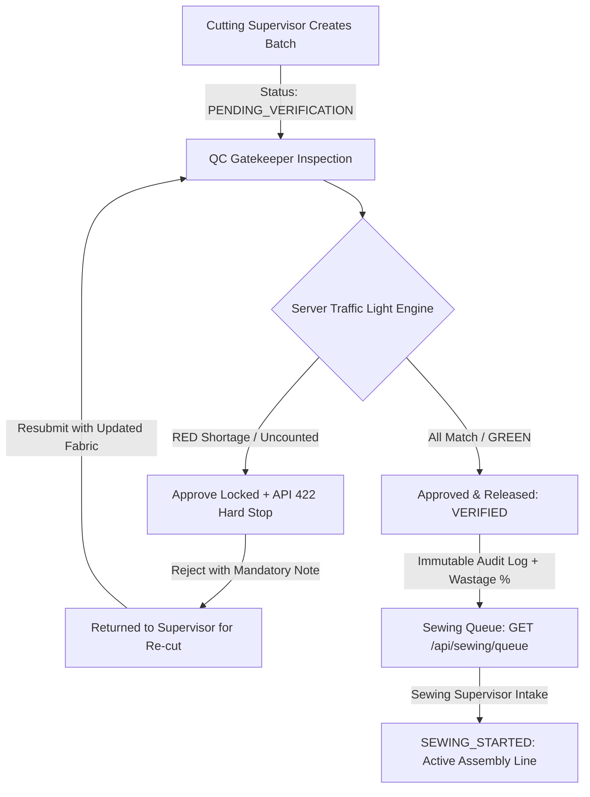

# AI Optimization & Engineering Judgment Report

**Assessment:** Practical Engineering Challenge — ApparelFlow ERP Execution System  
**Organization:** Webtezza (Pvt) Ltd  
**Candidate:** Keshan Randula ([apparelflow-cutting-gate](https://github.com/keshanrandula/apparelflow-cutting-gate))  
**Date:** October 2026  

---

## 1. Tools & Prompting

When building this project, I used AI tools primarily as a pair-programming assistant to speed up routine tasks like setting up boilerplate, writing initial Prisma schemas, and drafting test skeletons. However, all core domain logic, security checks, and state machine rules were planned, reviewed, and hardened by me.

### How I Used the Tools:
* **Anthropic Claude (Claude 3.5 Sonnet):** I used Claude during the initial planning phase to break down the assessment requirements into clean milestones. It was especially helpful for outlining manufacturing edge cases (like shortage handling, recipe multipliers, and wastage cap rules) and sketching initial test plans.
* **Google Antigravity (Gemini 2.5 Pro & Gemini 3.7 Flash):** I used Antigravity directly inside the IDE to quickly generate repetitive code—such as Next.js App Router boilerplate, initial Prisma migration drafts, Tailwind utility layouts, and Vitest test suites.

### My Prompting Workflow:
1. **Breaking work into small, focused steps:** Instead of asking the AI to "build the entire system" (which often produces shallow code with missing edge cases), I worked feature by feature:
   - First, modeling the database schema with explicit relational foreign keys and enums.
   - Second, writing pure domain calculation functions (BOM component multipliers, fabric wastage percentage formulas) backed by automated tests.
   - Third, implementing backend API routes with strict server-side Zod validation.
   - Finally, building the frontend dashboards with high-contrast UI controls and accessible states.
2. **Setting strict constraints in prompts:** I made sure to explicitly instruct the AI never to trust client request bodies for user identity, always extracting the session from HTTP-only cookies and returning precise HTTP status codes (`401`, `403`, `409`, `422`).

---

## 2. Flawed / Broken AI Code (Candid Discoveries)

While AI tools were great for speed, blindly accepting their output in production code is risky. During development, I caught several subtle security vulnerabilities, data sync bugs, and UI defects generated by the AI models. Here are three specific examples I found and fixed:

### Case 1: Insecure Client-Side RBAC & Forged Identity (Security Vulnerability)
* **What the AI generated:**  
  When scaffolding the verification approval route (`/api/verification/[id]/approve`), the AI accepted `verifierId` directly in the JSON request body and checked authorization on the frontend by simply disabling the button (`disabled={user.role !== 'cutting_verifier'}`).
* **Why it was broken:**  
  Any user (including a `cutting_supervisor` or an external attacker using Postman/cURL) could bypass the UI and send a POST request containing a fake `verifierId`, bypassing the factory's separation of duties.
* **How I fixed it:**  
  I removed `verifierId` from the request body schema entirely. The backend now extracts and verifies the authenticated user ID and role directly from the decrypted Jose JWT session cookie (`requireRole(session, [Role.cutting_verifier])`), rejecting any unauthorized caller with `403 Forbidden`.

```typescript
// Initial AI implementation (Vulnerable to ID spoofing):
export async function POST(req: Request) {
  const { verifierId, counts } = await req.json(); // Trusted unverified client body
  await prisma.cuttingOrder.update({ where: { id }, data: { verifiedById: verifierId } });
}

// Hardened production implementation (Zero-trust server session extraction):
export async function POST(request: Request, { params }: { params: Promise<{ id: string }> }) {
  const session = await requireAuth(request);
  requireRole(session, [Role.cutting_verifier]); // Server-enforced RBAC (403)
  const order = await approveOrder(session, (await params).id, validatedCounts);
}
```

---

### Case 2: Approval Payload Disconnect (Logic & Data Sync Bug)
* **What the AI generated:**  
  In the `VerificationDashboard` component, the AI separated "Save Progress" and "Approve Batch" into two disconnected API calls. When clicking "Approve", it dispatched `{ decision: 'APPROVED' }` without passing the latest component counts array.
* **Why it was broken:**  
  The server-side hard stop correctly evaluates counts before approving. Because the AI sent an empty payload, the server saw all components as `undefined` (uncounted) and rejected valid approvals with a false `SERVER GATEKEEPER RULE VIOLATION` error.
* **How I fixed it:**  
  I refactored both the client hook and the server service:
  1. Updated the client approval dispatcher to send the full `{ decision: 'APPROVED', counts: payload }` atomic payload.
  2. Enhanced the backend `approveOrder` service to use the passed counts or safely fall back to verified items saved in the database.

---

### Case 3: Contrast Defect & Raw Glyph Icon Clutter (UI / Accessibility)
* **What the AI generated:**  
  1. Inside form input fields and search bars, the AI used generic Tailwind classes that inherited text color poorly in dark mode, causing faint text contrast against light backgrounds.
  2. In the custom Toast notification system, the AI used raw Unicode text glyphs (`'ℹ'`, `'✓'`, `'✕'`) rather than SVG icons. This caused toast notifications to display literal "i" and "X" letters awkwardly on screen.
* **How I fixed it:**  
  1. Added explicit high-contrast text and background utilities (`text-[#111827]`, `bg-white`, `border-slate-300`, `focus:ring-orange-500/20`) to ensure 100% legibility in all lighting modes.
  2. Rebuilt the Toast component with clean, scalable SVG vector icons and polished glassmorphism styling.

---

## 3. Human Refactoring & Engineering Hardening

To transform the initial prototypes into an enterprise-grade ERP module, I applied engineering judgment in several key areas:

### 1. Pure Domain Isolation & Testability
I separated all business rules from database models and UI components into pure, deterministic helper functions (`src/server/domain/`):
* `computeItemStatus(expected, actual)`: Evaluates `GREEN` (exact match), `YELLOW` (surplus), or `RED` (shortage).
* `computeWastagePct(actualYds, stdYards, targetQty)`: Accurately calculates fabric variance against the recipe cap.
* `validateStateTransition(currentStatus, targetStatus)`: Ensures orders move strictly along the manufacturing pipeline.

### 2. Atomic Database Transactions with Race Condition Prevention
In a busy factory, two operators might click approve or reject simultaneously. I wrapped state changes in Prisma `$transaction` blocks and used conditional updates (`where: { id, status: OrderStatus.PENDING_VERIFICATION }`):
```typescript
const updateResult = await tx.cuttingOrder.updateMany({
  where: { id: order.id, status: OrderStatus.PENDING_VERIFICATION },
  data: { status: OrderStatus.VERIFIED, verifiedById: session.userId, verifiedAt: serverTimestamp },
});

if (updateResult.count === 0) {
  throw new InvalidTransitionError('Order was modified concurrently by another operator.');
}
```

### 3. Comprehensive Automated Test Suite
I wrote 42 automated tests in Vitest covering:
* Positive verification approvals (`all GREEN components`).
* Hard-stop rejection on shortages (`at least one RED component`).
* Mandatory rejection note validation (rejections without notes fail).
* Server-side RBAC guards (supervisors blocked from verifier endpoints).
* Query isolation (unverified orders strictly excluded from the Sewing Queue).

---

## 4. Defensive Architecture & Non-Bypassable Hard Stop



### End-to-End State Machine Workflow:
1. **Order Creation:** Cutting Supervisor creates a production batch (`targetQty`, `actualFabricYds`, `fabricRollId`). The order immediately enters `PENDING_VERIFICATION`.
2. **Gatekeeper Physical Count:** The QC Gatekeeper physically counts all garment components.
3. **Server Evaluation:** The backend recalculates item variances against recipe formulas.
   - *If any shortage occurs:* Approval is strictly blocked (`HTTP 422`). The Gatekeeper can only reject with a mandatory note, returning the batch to the supervisor.
   - *If counts match:* Gatekeeper digital sign-off transitions the order to `VERIFIED`.
4. **Sewing Queue Release:** Only `VERIFIED` batches appear on the sewing floor. The Sewing Supervisor assigns the batch to a machine line, transitioning it to `SEWING_STARTED`.

### Key Architectural Guarantees:
1. **Server Hard Stop (HTTP 422):** The backend recalculates every component against the BOM formula independently. UI bypass attempts via script or Postman fail immediately with HTTP 422.
2. **Database Query Isolation:** The sewing queue endpoint enforces `WHERE status = 'VERIFIED'` directly in SQL/Prisma, preventing URL parameter manipulation from leaking unverified batches.
3. **Immutable Audit Trail:** Approvals and rejections permanently record `verifierId`, server timestamp, defect notes, and wastage percentage to `verification_logs`. No manufacturing records can be deleted or overwritten.

---

## 5. Conclusion & Verification Summary

By applying human engineering rigor over raw AI assistance, the resulting system is resilient, secure, and compliant with all assessment specifications:

* **Automated Test Results:** 42 passed / 0 failed (100% across 9 suites)
* **RBAC Status:** Server-enforced via HTTP-only JWT cookies
* **Gatekeeper Hard Stop:** Active and verified against tampered requests
* **UI Accessibility:** High-contrast verified across light & dark themes
