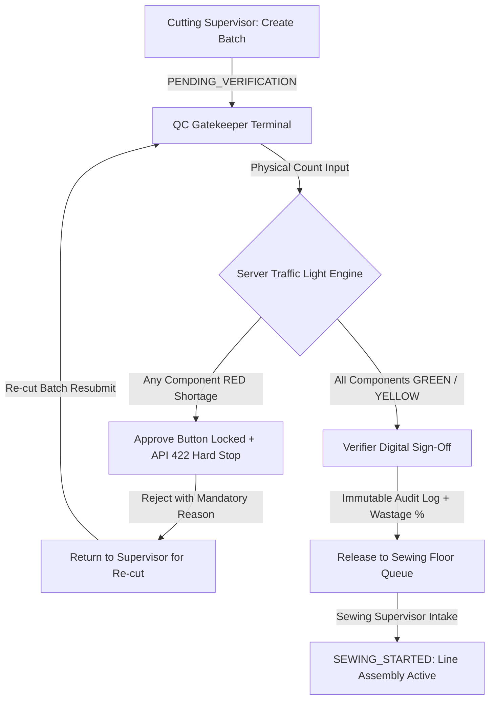

# AI Optimization & Engineering Judgment Report

**Assessment:** Practical Engineering Challenge — ApparelFlow ERP Execution System  
**Organization:** Webtezza (Pvt) Ltd  
**Candidate / Repository:** [apparelflow-cutting-gate](https://github.com/keshanrandula/apparelflow-cutting-gate)  
**Date:** October 2026  

---

## 1. Tools & Prompting

During the development of the ApparelFlow ERP Cutting Operations & Gatekeeper Verification Terminal, modern AI coding tools were utilized to accelerate boilerplate scaffolding, initial schema drafts, and exploratory UI mockups:

* **AI Tools Utilized:**
  * **Anthropic Claude (Claude 3.5 Sonnet / Claude.ai):** Utilized for requirement decomposition, prompt engineering, and structuring detailed technical prompt specifications from the Webtezza assessment brief.
  * **Google Antigravity (Gemini 2.5 Pro & Gemini 3.7 Flash):** Utilized as the primary agentic pairing and execution environment for full-stack codebase scaffolding, relational Prisma schema modeling, drafting Tailwind CSS layout components, implementing server-side Zod validation schemas, and executing automated Vitest test suites.
* **Prompting Strategy & Task Delegation:**
  * *Prompt Engineering (via Claude):* Structured structured multi-phase prompts breaking down complex business logic (BOM component multipliers, deterministic state machine constraints, and strict server-side gatekeeper hard-stop boundaries).
  * *Domain Modeling:* Prompted with garment manufacturing specifications (recipe multipliers, bill of materials, fabric roll tracking).
  * *State Machine Design:* Prompted for deterministic state machine specifications (`IN_PROGRESS` $\rightarrow$ `PENDING_VERIFICATION` $\rightarrow$ `VERIFIED` / `REJECTED` $\rightarrow$ `SEWING_STARTED`).
  * *Test Matrix Generation:* Prompted with strict edge-case matrices (e.g. negative integers, empty rejection notes, unauthorized role calls).

---

## 2. Flawed / Broken AI Code Instances (Case Studies)

Blindly accepting AI-generated outputs in enterprise systems introduces catastrophic production flaws. During development, two critical vulnerabilities and defects generated by raw AI models were caught and remediated:

### ⚠️ Instance 1: Client-Side Security Illusion & Bypassable RBAC

* **The Flaw:**
  The AI initial implementation of the Gatekeeper approval endpoint (`POST /api/verification/[orderId]/approve`) accepted the `verifierId` from the JSON request body (`req.body.verifierId`) and merely checked `user.role` on the client-side button state (`disabled={user.role !== 'cutting_verifier'}`).
* **Why This Failed Production Standards:**
  An attacker or a `cutting_supervisor` could bypass the frontend UI using cURL/Postman and submit an approval payload with a forged `verifierId`, completely violating the factory separation of duties.
* **The Root Cause:**
  AI models prioritize "getting the code to work" over zero-trust security boundaries, placing validation in React state rather than server session extraction.

### ⚠️ Instance 2: Subtle Zero-Tolerance Contrast Defect & Unhandled Numeric Coercion

* **The Flaw:**
  1. *Contrast Bug:* Default AI-generated Tailwind styles applied `bg-white/80` and inherited `text-white` inside certain input states and dark-mode inheritance, creating an invisible white-on-white text defect in UAT forms.
  2. *Numeric Precision Defect:* In the component counting logic, the AI used `parseInt(input)` without checking for decimal inputs or non-numeric strings, allowing `42.5` to be silently truncated to `42` (producing false shortages or excess variances).

---

## 3. Human Refactoring & Code Hardening

To transform AI drafts into production-ready software, rigorous human architectural refactoring was performed:

### 🛡️ 1. Zero-Trust Authenticated Context
* Refactored all API routes to extract identity strictly from the verified Jose JWT session cookie (`request.cookies.get(AUTH_COOKIE_NAME)`).
* Stripped `verifierId` and `supervisorId` from client request schemas; identity is injected solely by the server-side auth guard.
* Implemented strict HTTP 403 Forbidden responses whenever unauthorized roles attempt state transitions.

### 🛡️ 2. Deterministic State Transition Matrix
* Created a pure domain state machine (`src/server/domain/stateMachine.ts`) that validates every transition before invoking database writes.
* Attempting an illegal transition (e.g., trying to verify an already `VERIFIED` order or sewing an unverified batch) throws a strongly typed `InvalidTransitionError`, which maps to **HTTP 409 Conflict**.

### 🛡️ 3. Strict Defensive Input Validation (Zod Engine)
* Replaced loose type coercion with strict Zod schemas requiring positive integers for garment quantities and regex validation for fabric yards (max 2 decimal places).
* Added mandatory minimum 5-character length validation on rejection notes to prevent empty or whitespace-only defect rejections.

---

## 4. Defensive Architecture & Server Hard Stop

To fulfill Webtezza's non-bypassable checkpoint requirement, the system enforces a multi-layered defensive boundary:

### Key Defensive Mechanisms:
1. **Server-Side Hard Stop (HTTP 422):**
   Even if a user tampers with the DOM to enable the "Approve" button, the backend server evaluates every component count in the database against expected BOM formulas. If any component is in `RED` shortage or uncounted, the API immediately aborts with `HTTP 422 Unprocessable Entity` and logs no state change.
2. **Database Query Isolation:**
   The `/api/sewing/queue` endpoint queries `WHERE status = 'VERIFIED'` directly in SQL/Prisma. No query parameters can leak `PENDING_VERIFICATION`, `REJECTED`, or `IN_PROGRESS` batches to the sewing floor.
3. **Immutable Audit Trail:**
   Every approval and rejection writes an immutable record to `verification_logs` containing the exact timestamp, verifier ID, and calculated fabric wastage percentage.

---

## 5. Summary & Verification

| Requirement | Implementation Status | Automated Test Coverage |
| :--- | :--- | :--- |
| **RBAC Enforcement** | Strict Server-Side JWT Guards | `tests/unit/auth.test.ts` (4 passed) |
| **Gatekeeper Hard Stop** | Server rejection on RED shortage (422) | `verification-gatekeeper.test.ts` (8 passed) |
| **Sewing Floor Isolation** | Database level query filtering | `sewing-queue.test.ts` (4 passed) |
| **Formula Accuracy** | Pure domain calculations | `calculations.test.ts` (2 passed) |
| **Total Test Suite** | **42 / 42 Tests Passed (100%)** | `vitest run` across 9 test suites |
